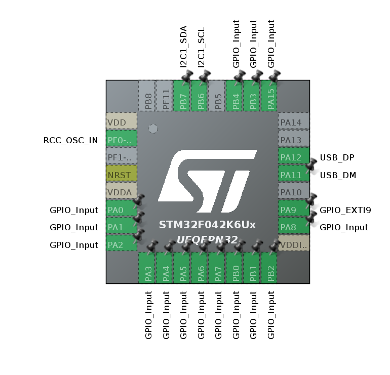

# Gamepad Extension for the Mecha Comet

## Pin out configuration for the STM32


## St-Cube IDE Setup
- Clone this repo
- Install STCube IDE (This commit is written in v_1.19.0)
- Login to STMCube using MyST
- File -> Open Project From File System
- Depending on your OS, you might have to install arm-gcc cross compiler

## Flashing Instructions for the STM322
- Connect SWDIO, SWDCL, 3v3, GND
- Build and flash using Debug on STCubeIde 

## Button Mapping
A, B and M are the (ABXY), Left DPad and the center DPad respectively.

```
Button A1: A0
Button A2: A1
Button A3: A2
Button A4: A3

Button B1: A4
Button B2: A5
Button B3: A6
Button B4: A7

Button M1: B0
Button M2: B1
Button M3: B2
Button M4: A8

Button S1: B4
Button S2: B3
Button S3: A15
```

## Joystick Report Container Description
The struct defined for the descriptor is:
```c
typedef struct {

	uint8_t buttons; 
    int8_t  x;
    int8_t  y;
    int8_t  z;
    int8_t  rx;
    int8_t  ry;
    int8_t  rz;

} joystickReport;
```
### Buttons

Bit shifted to accomodate all button presses as read in each cycle:

```
joystickReportContainer.buttons = (button_A1 << 7) | (button_A2 << 6) | (button_A3 << 5) | (button_A4 << 4) | (button_B1 << 3) | (button_B2 << 2) | (button_B3 << 1) | (button_B4) ; 
```
### Axes
x, y, z and rx, ry, rz are the axes for the joystick, must be mapped to the azoteq trackpad.

## HID Descriptor

```
__ALIGN_BEGIN static uint8_t HID_MOUSE_ReportDesc[HID_MOUSE_REPORT_DESC_SIZE] __ALIGN_END =
{
  0x05, 0x01,        /* Usage Page (Generic Desktop Ctrls)     */
  0x09, 0x04,        /* Usage (Joystick)                          */
  0xA1, 0x01,        /* Collection (Application)               */
  0x09, 0x01,        /*   Usage (Pointer)                      */
  0xA1, 0x00,        /*   Collection (Physical)                */

  0x05, 0x09,        /*     Usage Page (Button)                */
  0x19, 0x01,        /*     Usage Minimum (0x01)               */
  0x29, 0x08,        /*     Usage Maximum (0x03)               */
  0x15, 0x00,        /*     Logical Minimum (0)                */
  0x25, 0x01,        /*     Logical Maximum (1)                */
  0x95, 0x08,        /*     Report Count (8)     (changed)              */
//  0x95, 0x04,        /*     Report Count (3)                   */
  0x75, 0x01,        /*     Report Size (1)                    */
  0x81, 0x02,        /*     Input (Data,Var,Abs)               */

  0x05, 0x01,        /*     Usage Page (Generic Desktop Ctrls) */
  0x09, 0x30,        /*     Usage (X)                          */
  0x09, 0x31,        /*     Usage (Y)                          */
  0x09, 0x32,        /*     Usage (Z)                          */
  0x09, 0x33,        /*     Usage (Rx)                         */
  0x09, 0x34,        /*     Usage (Ry)                         */
  0x09, 0x35,        /*     Usage (Rz)                         */
  0x15, 0x81,        /*     Logical Minimum (-127)             */
  0x25, 0x7F,        /*     Logical Maximum (127)              */
  0x75, 0x08,        /*     Report Size (8)                    */
  0x95, 0x06,        /*     Report Count (3)                   */
  0x81, 0x02,        /*     Input (Data,Var,Rel)               */

  0xC0,              /*   End Collection                       */
  0xC0               /* End Collection                         */
};

```
```./Core/Middlewares/ST/STM32_USB_Device_Library/Class/HID/Src/usbd_hid.c```

> [!NOTE]
> Name of the function remains HID_MOUSE_ReportDesc() for testing. Feel free to rename it to a gamepad descriptor. The extension is detected as a gamepad.


